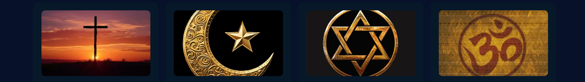

# Religiões em conexão


<div align="center">
  
</div>

> Site educativo com informações introdutórias e respeitosas sobre diferentes tradições religiosas e filosofias, pensado para escolas e espaços de diálogo.

[](LICENSE)

## 🚀 Demo local
Abra ReligioesEmConexao.html no navegador (duplo clique ou via Live Server no VS Code).

## 👥 Equipe do Projeto

| Nome                  | Série      | Função no projeto                  |
|-----------------------|------------|------------------------------------|
| Arthur Dimer          | 1º Ano     | linhas de códigos                  |
| Livia                 | 1º Ano     | Apresentação                       |
| Vitor Paim            | 1º Ano     | pesquisa                           |
| Vitor Cunha           | 1º Ano     | Desing                             |

## 📖 Sobre o projeto

Religiões em Conexão é uma página informativa construída em HTML/CSS/JS que apresenta cartões (cards) com descrições resumidas, imagens e um botão "Leia mais" para expandir conteúdo adicional. O objetivo é informar, promover respeito e facilitar discussões em ambiente escolar.

Principais páginas/arquivos:
- ReligioesEmConexao.html — conteúdo principal (cards, estrutura e scripts)
- estiloreligioes.css (ou equivalente) — estilos do site
- imagens/ — pasta com ícones e fotos ilustrativas
- js/ — scripts de comportamento (toggle "Leia mais")

## 🛠 Tecnologias utilizadas


## ⚙️ Funcionalidades implementadas

- [x] Página responsiva com grid de cards
- [x] Botões "Leia mais" que expandem conteúdo (toggle)
- [x] Estrutura acessível básica (aria-controls, aria-expanded, role)
- [x] Imagens ilustrativas para cada card
- [ ] Conteúdo ampliado e referências (em desenvolvimento)

## 📝 Como contribuir / editar conteúdo

- Abra ReligioesEmConexao.html no VS Code.
- Cada card é um <article class="card"> — edite título (h3), texto (p) e imagens (src).
- Verifique unicidade de ids (ex.: id="more-xxx") para que os botões funcionem.
- Para testar localmente use extensão Live Server ou abra o HTML diretamente.

## 📂 Estrutura de pastas sugerida

```
├── imagens/           → ícones e fotos (ex.: taoismo.jpg, umbanda.png)
├── css/               → estilos (ex.: estiloreligioes.css)
├── js/                → scripts (toggle.js)
├── ReligioesEmConexao.html
└── README.md
```

## 🏆 Créditos

Projeto desenvolvido pela equipe "Coders da ETEP 2025" — versão adaptada ao trabalho escolar sobre tradições religiosas.

---

## 🔗 Links importantes

- 🖌 Protótipo no Figma → https://www.figma.com/file/xxxx
- 🌐 Projeto rodando → https://seu-projeto.vercel.app
- 🎥 Vídeo de apresentação (obrigatório!) → https://youtu.be/xxxxxx

## 📹 Vídeo de apresentação do projeto

[](https://www.youtube.com/watch?v=SEU_ID_DO_YOUTUBE)

(Duração: 3min30s — explicamos o problema, as funcionalidades e mostramos o sistema funcionando)

## 📚 O que aprendemos com esse projeto

- Trabalho em equipe real com Git (branches, pull requests, issues)
- Divisão justa de tarefas respeitando o nível de cada série
- Como fazer um deploy de verdade (Vercel + banco online)
- Segurança básica (senhas criptografadas, proteção contra SQL Injection)
- Responsividade e acessibilidade
- Apresentação profissional do trabalho (documentação + vídeo)

## 🏆 Agradecimentos

- Aos professores que nos orientaram durante todo o ano
- À bibliotecária da escola que nos deu ideias e testou o sistema
- Aos colegas que ajudaram nos testes
- Aos tutoriais do YouTube que salvaram nossa vida nas madrugadas 😅

---
**Feito com muito carinho e café ☕ pela equipe "Coders da ETEP 2025"**  
Curso Técnico em Desenvolvimento de Sistemas — ETEP 2025
